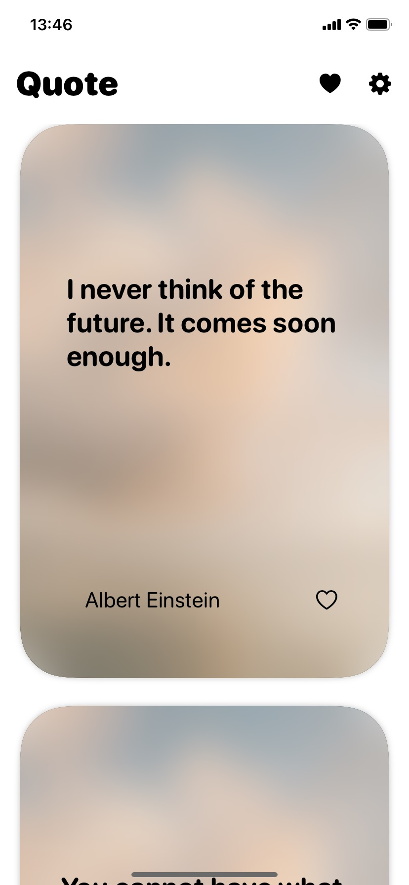
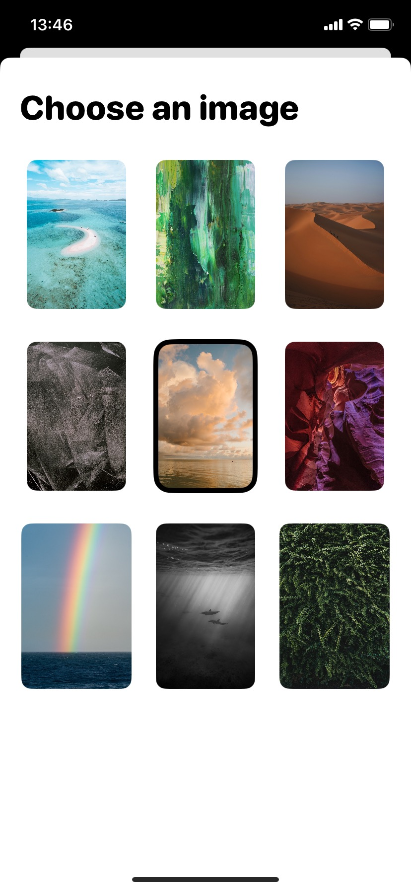
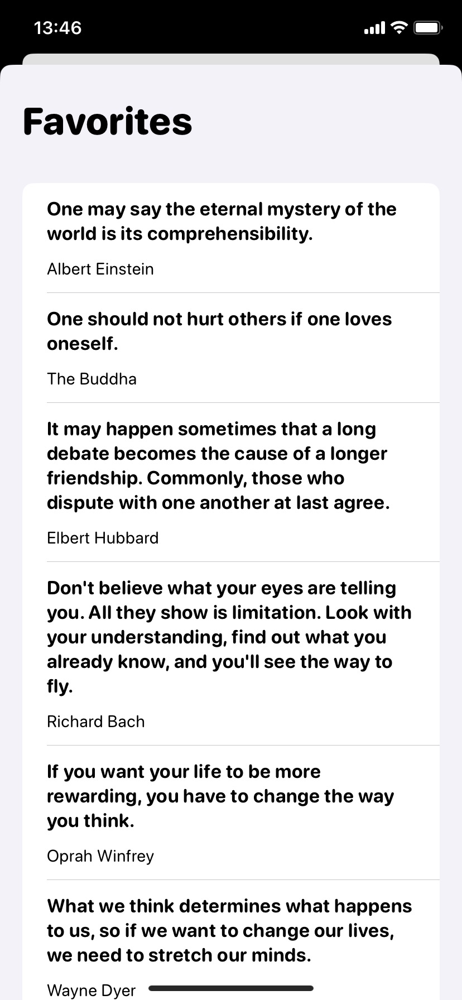
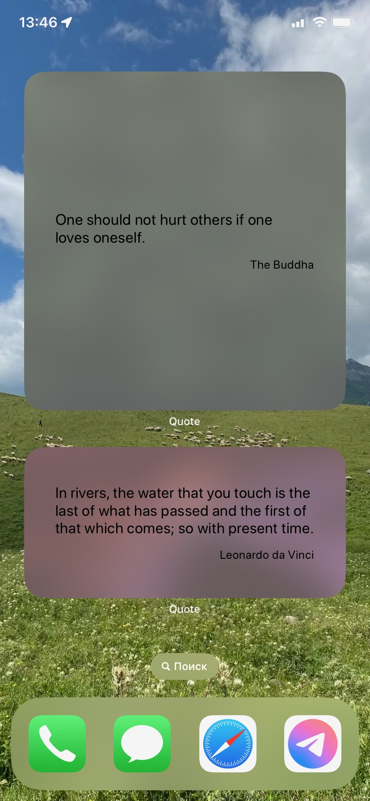
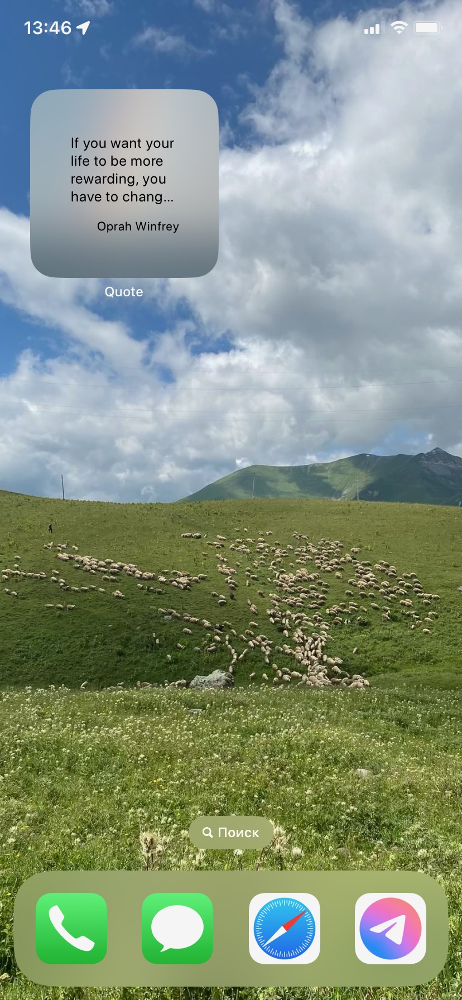

## Quote

Quote is a viewing application created using the [free quoting API](https://github.com/lukePeavey/quotable) in Swift UI.

  [](https://developer.apple.com/ios/)

## Demo
|                             iOS                              |                            Widget                            |
| :----------------------------------------------------------: | :----------------------------------------------------------: |
|   |  |

## Getting Started

To get started with Quote, follow these steps:

1. Clone the repository:

   ```
   git clone https://github.com/petrenkodaria/quote.git
   ```

2. Open the Xcode project file.

3. Build and run the app on your iOS device or simulator.

## Requirements

- iOS 16.0 and later


## Stack

- MVVM
- SwiftUI
- CoreData
- WidgetKit
- Alamofire

## Contributing

Contributions to Converter Currency Converter are welcome! If you find any issues or want to suggest improvements, please submit a pull request or open an issue on the [GitHub repository](https://github.com/petrenkodaria/converter).

## Contact

For any inquiries or feedback, feel free to reach out to us at [petrenkodariarom@icloud.com](mailto:petrenkodariarom@icloud.com).
